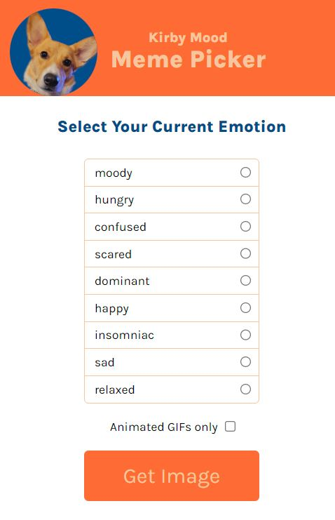
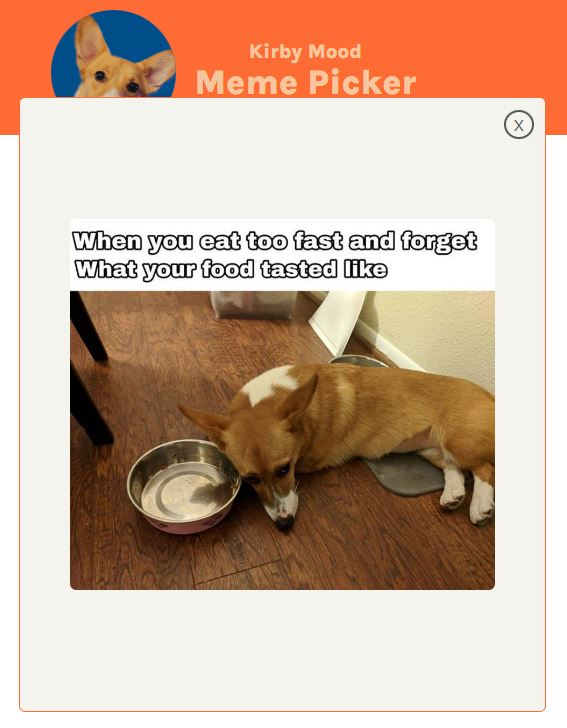

### Kirby Meme Generator

This project was created using HTML, CSS, and Vanilla JavaScript. It uses an internal data set of memes from: 
- [Giphy](https://giphy.com/)

### Screenshot

Landing page, from the list you can select mood you are feeling or want to see. There is also an option to filter only GIFs.

After selecting the GET IMAGE button you will see a random meme from the internal data set of corgi memes.

## About Scrimba
The Frontend Developer Career Path aims to teach you everything you need to become a Junior Developer, or you could take a deep-dive with one of our advanced courses 🚀. Scrimba was the bootcamp where the project idea came from. I modified the CSS and created my own data file of Corgi memes for the project.

- [Our courses](https://scrimba.com/allcourses)
- [The Frontend Career Path](https://scrimba.com/learn/frontend)
